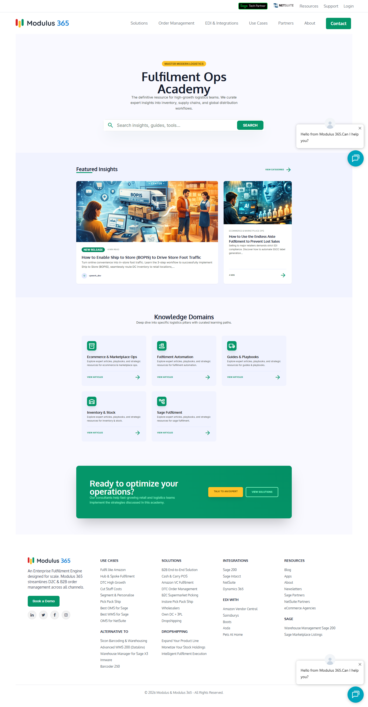
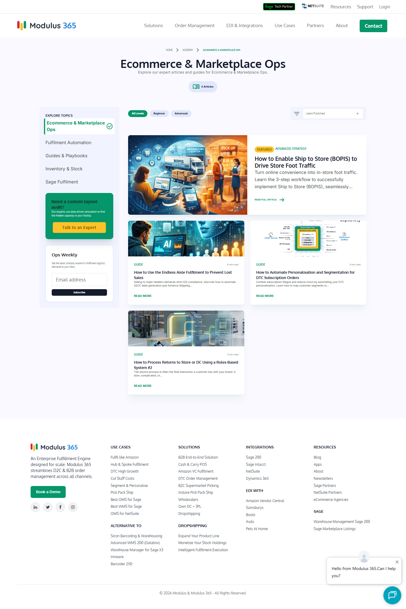
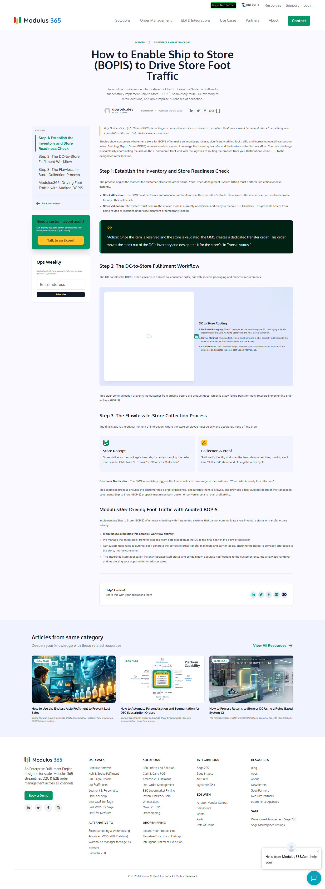

# WordPress Fulfilment Ops Academy

A complete WordPress solution for creating a knowledge hub for logistics operations. This repository includes a custom plugin to register the **Academy** post type and taxonomy, plus three modern template files (archive, category, single) built with Tailwind CSS.

## Features

- **Custom Post Type** `academy` for articles
- **Custom Taxonomy** `academy_category` for categorising articles (e.g., Inventory, Supply Chain, Warehousing)
- **Archive Page** – displays recent articles with search, categories grid, and featured cards
- **Category Archive** – full‑width layout with sidebar, topics navigation, and article listing
- **Single Article** – includes table of contents (auto‑generated from H2 headings), reading time, author info, social sharing, and related articles
- **Modern Design** – uses Tailwind CSS, Google Fonts (Oxygen, Inter, Manrope), and Material Icons
- **Gutenberg Ready** – `show_in_rest` enabled for both post type and taxonomy

## Requirements

- WordPress 5.0 or higher
- PHP 7.4 or higher
- A WordPress theme that supports template files (any theme will work – just copy the template files into your active theme folder)

## Installation

1. **Install the plugin**  
   Upload the `academy-plugin.php` file to `/wp-content/plugins/` and activate it via the WordPress admin.  
   This creates the "Academy" post type and the "Academy Sections" taxonomy.

2. **Add the templates**  
   Copy `archive-academy.php`, `taxonomy-academy_category.php`, and `single-academy.php` into your active theme folder (e.g., `/wp-content/themes/your-theme/`).

3. **Create some categories (Sections)**  
   Go to **Academy → Academy Sections** and add categories like “Inventory Management”, “Supply Chain”, “Warehousing”, etc.

4. **Start writing articles**  
   Create new posts under **Academy** and assign them to a section. Add a featured image for each article.

5. **View the Academy**  
   Visit `/fulfilment-ops-academy/` on your site to see the archive page. Click on any category to see the category archive, or on an article to view the single page.

## Customisation

- **Tailwind CSS** – The templates include a CDN link with a custom configuration (colors, fonts, etc.). You can replace it with a local build if needed.
- **Color Scheme** – The color palette is defined in the Tailwind config inside each template. Modify the `colors` object to match your brand.
- **Table of Contents** – Automatically generated from H2 headings. To exclude certain headings, adjust the regex in `single-academy.php`.

## File Structure

- `academy-plugin.php` – Registers CPT and taxonomy
- `archive-academy.php` – Main archive page
- `taxonomy-academy_category.php` – Category archive page
- `single-academy.php` – Single article page
- `README.md` – This file

## Demo

## About the Author

[Amit Nandi](https://github.com/amitwpseo) – Top Rated WordPress Developer and Local SEO Specialist.

## License

MIT License – free to use, modify, and distribute.
